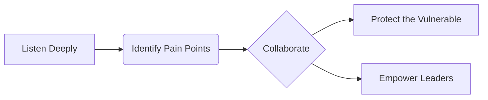

# Troven  
### Community Alchemist  
*Turning digital spaces into meaningful places*

---

#### 🔮 Core Belief  
> *"Free, volunteer-driven communities are the soul of the internet.  
> My role isn’t to manage, but to* ***facilitate trust****."*

---

### What I Do  
- **Volunteer Discord Steward**: Nurture communities pro bono  
- **Conflict Resolver**: Mediate disputes in high-traffic servers  
- **Event Architect**: Design gatherings that turn strangers into allies  
- **Documentation Gardener**: Keep knowledge alive and accessible  

---

### Active Communities I Support  
`🎮 Retro Gaming Haven` (1.2k members)  
`🌱 Mental Health Safehouse` (800+ members)  
`🎨 Digital Artist Collective` (Moderator since 2022)  

---

### How I Work  

---

📫 **Reach Out**: [yourname@email.com](mailto:...)  
*I respond to humans, not bots or agencies.*  
