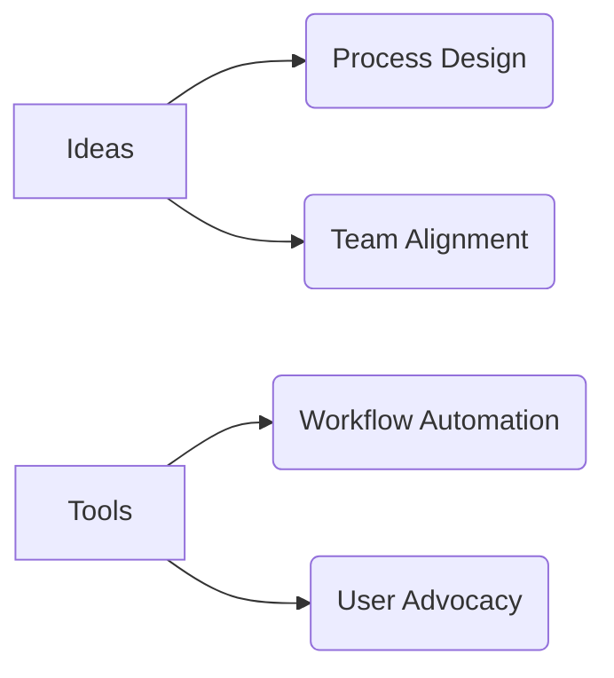

#  [Your Name] | Systems Strategist

> **Workflow Architect** · **Process Optimizer** · **Collaboration Catalyst**

```diff
+ Philosophy: "Tools should serve people, not the other way around."
```

---

###  Tools of the Trade


---

<div align="center">



</div>

---

###  Current Focus

**Building systems that help teams:**  
✅ Reduce tool chaos  
✅ Clarify priorities  
✅ Ship work faster  

*(No code required – just smart workflows!)*

---

###  Active Projects

<table>
  <tr>
    <td width="50%">
    
#### 🏗️ Process Templates
- [Team Prioritization Framework](https://your-notion-link.com)  
*(Notion template for sprint planning)*
- [Cross-Functional Playbook](https://your-airtable-link.com)  
*(Airtable base for project handoffs)*
    </td>
    <td width="50%">
    
#### 🧪 Experiments
- [Meeting Cost Calculator](https://your-figma-link.com)  
*(Figma prototype for optimizing agendas)*
- [Async Work Hub](https://your-slack-channel.com)  
*(Slack channel for documentation)*
    </td>
  </tr>
</table>

---

###  Let’s Connect

🔗 [LinkedIn](https://linkedin.com/in/your-profile)  
📧 [Email](mailto:you@domain.com)  
🗓️ [Schedule a Chat](https://calendly.com/your-link)  

```

---

**Metrics**: Track my team’s workflow impact → [Troven Dashboard](https://linear.app/troven)
