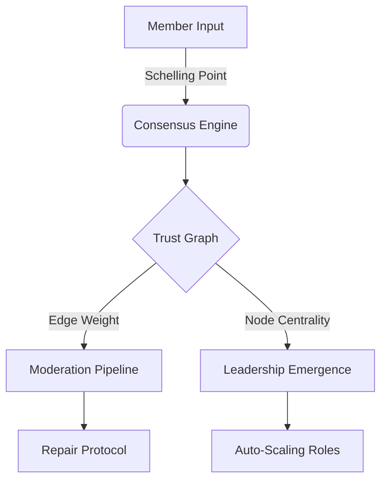

# TROVΞN  
### Community Systems Architect  
*Designing human protocols for digital tribes*

---

## PRINCIPLES  
```rust
// src/manifesto.rs
pub struct Philosophy {
    pub trust_as_primitive: bool, // = true
    pub chaos_to_cohesion: fn(Community) -> Ecosystem,
    pub failure_modes: Vec<FailureMode> = vec![
        FailureMode::Centralization,
        FailureMode::InvisibleLabour,
    ],
}
```

---

## CORE OPERATIONS  
- **Conflict Resolution Engine** (CRDT-inspired mediation workflows)  
- **Knowledge Graph Maintenance** (anti-entropy documentation systems)  
- **Event Loop Optimization** (gatherings with O(1) nostalgia payoff)  
- **Boundary Conditions** (safe space topology enforcement)  

---

## NOTABLE RUNTIMES  
```nginx
# Production environments maintained under SLA
location /communities {
    proxy_pass http://retro-gaming-haven/1.2k_members;
    proxy_set_header X-Resilience "Survived 2023 API wars";
    
    proxy_pass http://mental-health-safehouse/800+_members
        if ($http_user_agent !~* "troll");
    
    proxy_pass http://digital-artist-collective/2024-edition
        with ZeroDowntimeModerationUpgrade;
}
```

---

## SYSTEM ARCHITECTURE  


---

## METRICS  
```python
# metrics.py
class CommunityHealth:
    def __init__(self):
        self.sli = {
            'toxicity_containment': 99.9%, 
            'knowledge_retention': 95%ile,
            'trust_gradient': PositiveDefiniteMatrix()
        }
        self.error_budget = ErrorBudget(
            disputes_per_epoch=42,
            burnout_rate=Δ<0.1
        )
```

---

**// OODA Loop**  
**O**bserve → **O**rient → **D**ecide → **A**ct  

✉️ **RFC 5322 Compliance**: `rasphry@gmail.com`  
