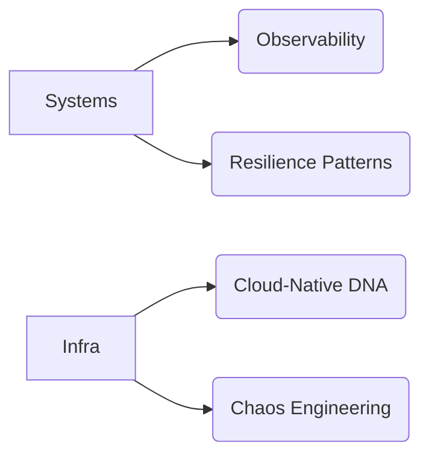

#  [Your Name] | Principal Engineer

> **Systems Architect** · **Open Source Advocate** · **DevOps Anthropologist**

```python
#!/usr/bin/env ethos
# Axiom: Complexity should emerge from simplicity, not vice versa
```

---

###  Core Stack


---

<div align="center">



</div>

---

###  Current Trajectory

```rust
// Building in stealth:
struct NextGenPlatform {
    runtime: Box<dyn WasmEdge>,
    orchestration: K8sOperator,
    observability: TelemetryPipeline,
}
```

---

###  Operational Artifacts

<table>
  <tr>
    <td width="50%">
    
#### 🏗️ Active Foundations
- [ ] [Envoy WASM Filter Framework](https://github.com/...)
- [ ] [K8s Admission Controller Toolkit](https://github.com/...)
    </td>
    <td width="50%">
    
#### 🧪 Experimental Lab
- [Temporal Workflow Optimizer](https://github.com/...)
- [eBPF-based Service Mesh](https://github.com/...)
    </td>
  </tr>
</table>

---

###  Contact Protocol

```nginx
# Preferred channels
location /connect {
    proxy_pass https://linkedin.com/in/[username];
    proxy_pass mailto:name@domain.com;
    proxy_pass ssh://git@github.com/[username].pub;
}

# PGP: 4096R/0xABCD1234
```

---


