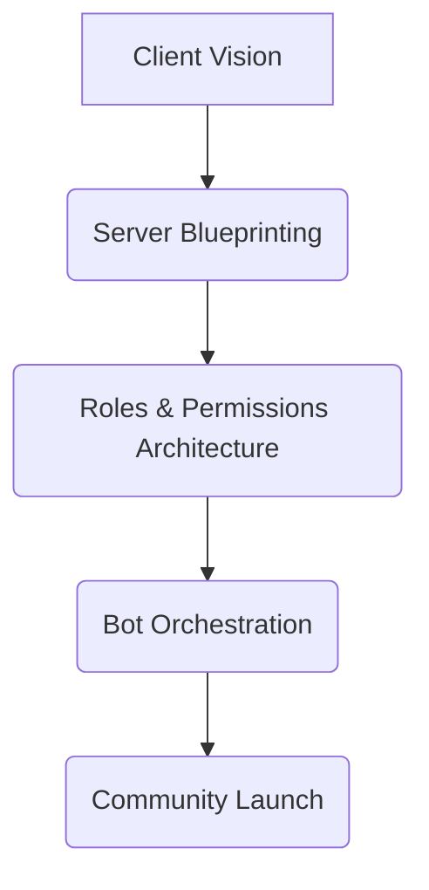

#  [Your Name] | Discord Architect

> **Community Engineer** · **Bot Whisperer** · **Server Sculptor**

```diff
+ Philosophy: "Discord isn’t just a tool – it’s a digital ecosystem."
```

---

###  Toolkit


---

<div align="center">



</div>

---

###  Current Focus

**Crafting servers that:**  
✅ Convert chaos into **structured engagement**  
✅ Turn members into **brand advocates**  
✅ Scale safely with **auto-mod magic**  

---

###  Signature Services

<table>
  <tr>
    <td width="50%">
    
#### 🏰 Server Foundations
- **DiscordOS**  
*Modular server templates for gaming/SAAS/DAO communities*  
- **Guardian Setup**  
Automod configs + verification workflows  
    </td>
    <td width="50%">
    
#### 🤖 Bot Ops
- **Ticket Factory**  
Custom support systems with DiscordTickets  
- **MEE6 Mastery**  
XP roles, auto-announcements, moderation  
    </td>
  </tr>
</table>

---

###  Connect

🎯 [Join Our Demo Server](https://discord.gg/your-invite)  
📧 [Agency Email](mailto:hello@your-agency.com)  
📋 [Service Menu](https://your-notion-site.com)  

---

**Recent Builds**: [Gaming Community](https://discord.gg/example) · [Web3 DAO](https://discord.gg/example2)  
